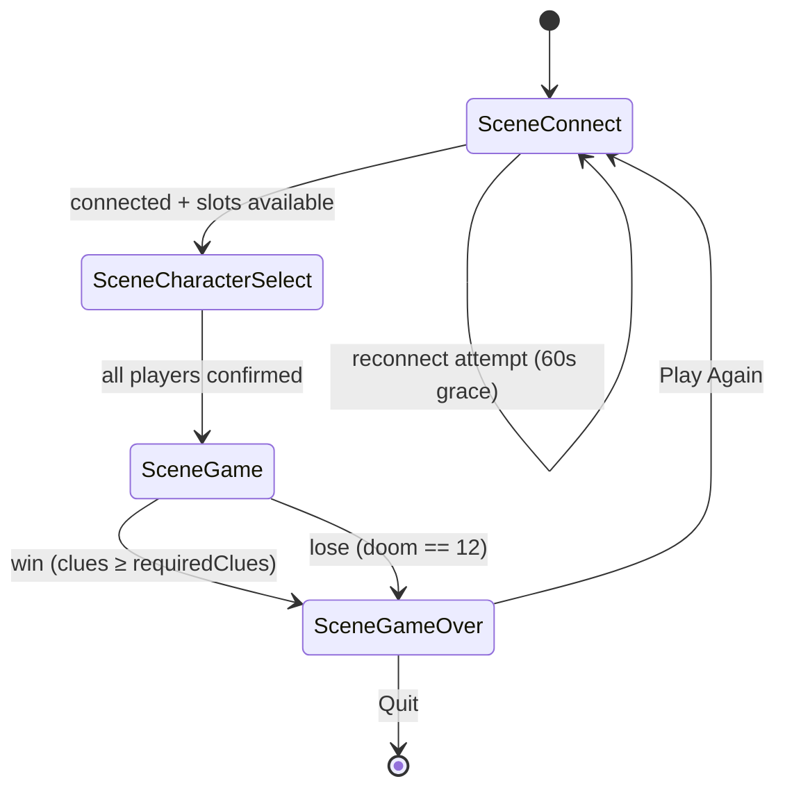

# Ebitengine Client Specification

> This document defines the UI/UX requirements for the BostonFear Ebitengine client.
> It is intended to be self-sufficient for an Ebitengine developer with no prior
> context on the legacy HTML/JS client. Requirements cite their source document
> where one exists; items without a cited source are new UX decisions introduced by
> this spec.

---

## 1. Ebitengine Architecture Overview

### Scene State Machine

The client is organized as a finite state machine of four scenes:

```
SceneConnect → SceneCharacterSelect → SceneGame → SceneGameOver
```



### Rendering

- **Logical resolution**: 1280×720, scalable to window size (source: ROADMAP.md Phase 5 — resolution strategy)
- **Minimum window size**: 1024×600 (derived from logical resolution 1280×720 at ~80% scale)
- **Target frame rate**: 60 FPS (Ebitengine default; source: ROADMAP.md Phase 5 — "≥ 60 FPS on desktop")
- **Layout method**: `ebiten.Game.Layout` returns the logical size (1280×720); the framework handles scaling to the actual display

### Input Model

- Mouse click regions + keyboard shortcuts for all interactive elements (source: ROADMAP.md Phase 1 — `input.go`)
- Touch input on mobile platforms via `ebiten.TouchID` mapping (source: ROADMAP.md Phase 4)

### Assets

- Embedded via `go:embed`; sprite sheet layout TBD per art pipeline (source: ROADMAP.md Phase 5 — sprite atlas loader)
- Placeholder programmer-art assets used until Phase 5 rendering is complete

---

## 2. Joining a Game (SceneConnect)

### Input Fields

- **Server address**: text field, default `localhost:8080` — the client appends the WebSocket path (`/ws`) internally (source: README.md Quick Setup — default server address; ROADMAP.md Phase 2 — `-server ws://localhost:8080/ws` flag)
- **Player display name**: text field, required before connection attempt

### Connection States

```
Idle → Connecting → WaitingForPlayers (show slot count) → InProgress
```

### Player Slots

- Display 1–6 slots; minimum 1 player to start (source: RULES.md — "1-6 player support"; `cmd/server/constants.go` `MinPlayers=1`, `MaxPlayers=6`)
- Highlight open vs. filled slots
- When all 6 slots are filled, display "Game Full (6/6)" and disable the Join button

### Reconnection Flow

1. On launch, check `~/.bostonfear/session.json` for a saved reconnection token (source: PLAN.md Step 5 — reconnection token system)
2. If a token is present, attempt auto-reconnect with a 60-second countdown overlay (source: GAPS.md — "Reconnection Does Not Restore Session State", 60-second grace period)
3. On success: restore player state (location, health, sanity, clues, turn position) from the server's `gameState` message
4. On failure or timeout: fall back to new-player flow (clear the saved token)

### Error States

- **Server unreachable**: "Cannot connect to <address> — retrying every 5 s" (source: README.md — "Automatic reconnection with 5-second retry")
- **Game full (6/6)**: "Game is full. Waiting for a slot…"

---

## 3. Character Selection (SceneCharacterSelect)

### Investigator Grid

- Grid of investigator cards showing:
  - Name
  - Portrait region (sprite sheet coordinates, placeholder rectangle until art pipeline delivers assets)
  - Starting Health (1–10), Sanity (1–10), Clues (0–5) (source: README.md Core Game Mechanics — Resource Tracking)

### Real-Time Lock-Out

- Gray out investigators already chosen by other players (sourced from `gameState` messages; source: README.md — "Real-time game state synchronization")

### Confirm Button

- Enabled only when a selection is made and the slot is free
- Sends: `{"type":"playerAction","playerId":"<id>","action":"selectInvestigator","target":"<name>"}` (source: README.md JSON Message Protocol — `playerAction`)

### Waiting State

- Show which players have / have not confirmed their selection
- Advance to SceneGame when all connected players have confirmed

---

## 4. In-Game Screen (SceneGame)

### 4.1 Board View

- **4 neighborhood nodes**: Downtown, University, Rivertown, Northside (source: README.md Core Game Mechanics — Location System)
- Labeled adjacency edges drawn between connected nodes (source: README.md — "movement restrictions between adjacent areas only")
- Player token sprites placed at `gameState.players[n].location`
- **Clickable move targets**: when Move action is selected, highlight valid adjacent locations; non-adjacent nodes are non-interactive

### 4.2 Action Panel

- **4 action buttons**: Move, Gather, Investigate, Cast Ward (source: README.md Core Game Mechanics — Action System)
- **Remaining actions counter** (0–2); all buttons disabled when `actionsRemaining == 0` or it is not the local player's turn (source: README.md — "2 actions per turn")

#### Per-Action Disable Rules

| Action | Disabled When | Source |
|---|---|---|
| Move | No valid adjacent location available | README.md — Location System adjacency |
| Gather | `actionsRemaining < 1` | README.md — Action System |
| Investigate | `actionsRemaining < 1` | README.md — Action System |
| Cast Ward | `sanity < 1` OR `actionsRemaining < 1` | README.md — "Costs 1 Sanity" |

### 4.3 Resource HUD

- Per-player strip:
  - **Health bar**: green → red gradient (source: README.md — Health 1–10)
  - **Sanity bar**: blue → purple gradient (source: README.md — Sanity 1–10)
  - **Clue badge**: numeric (source: README.md — Clues 0–5)
- Active player highlighted; all others show "Waiting…" label

### 4.4 Doom Counter

- Numeric display 0–12 with thematic icon (source: README.md Core Game Mechanics — Doom Counter)
- Visual states:
  - **Neutral** (0–8): default styling
  - **Amber pulse** (9–11): warning animation
  - **Red flash** (12): game-ending alert
- **Win progress bar**: `totalClues / requiredClues` where `requiredClues = playerCount × 4` (source: README.md Win/Lose Conditions — "4 clues per investigator"; `gameState.requiredClues` per PLAN.md Step 2)

### 4.5 Dice Result Overlay

- Triggered by `diceResult` message (source: README.md JSON Message Protocol — `diceResult`)
- Animated die face sprites:
  - Success ✓
  - Blank ○
  - Tentacle 🐙
- Auto-dismiss after 2.5 seconds or on any input
- Must not block the action panel (UX: overlay renders above the board but does not capture input from the action panel region)

### 4.6 Event Log Panel

- Scrollable list of `gameUpdate` entries; newest at bottom; max 50 entries (source: README.md JSON Message Protocol — `gameUpdate`)
- Entry format: `[HH:MM:SS] PlayerName action → result (doom Δ, resource Δ)`
- Chat messages displayed with distinct color (see Section 5)

---

## 5. Player Communication

### Quick-Chat Panel

- Collapsible panel with a minimum of 6 predefined phrases:
  1. "Move to Downtown?"
  2. "I'll Investigate here"
  3. "Need healing"
  4. "Cast Ward!"
  5. "Watch the Doom!"
  6. "Good job!"
- Sends: `{"type":"playerAction","playerId":"<id>","action":"chat","target":"<phrase>"}` (source: README.md JSON Message Protocol — `playerAction`)
- Received chat entries appear in the Event Log (Section 4.6)

### Connection Quality Badge

- Per-player badge: **Good** / **Degraded** / **Poor** (sourced from `connectionStatus` latency data; source: README.md JSON Message Protocol — `connectionStatus`)

### Disconnect Notice

- "Disconnected" badge on player token when `connected == false` (source: GAPS.md — orphaned player slot stays with `Connected: false`)
- Show 60-second grace countdown (source: PLAN.md Step 5 — 60-second reconnection grace period)

---

## 6. Game Over Screen (SceneGameOver)

### Win

- "Victory" banner
- Stats: total clues gathered, doom level reached, elapsed time
- Source: README.md Win/Lose Conditions — "Collectively gather 4 clues per investigator"

### Lose

- "Defeat — Doom Reached 12" banner
- Final stats: clues gathered, doom level, elapsed time
- Source: README.md Win/Lose Conditions — "Doom counter reaches 12"

### Buttons

- **Play Again** → transitions to SceneConnect
- **Quit** → exits the process

---

## 7. Non-Functional Requirements

| Requirement | Target | Source |
|---|---|---|
| Render rate | 60 FPS | Ebitengine default; ROADMAP.md Phase 5 |
| Input latency | < 16 ms click → action send | 1-frame budget at 60 FPS |
| State render lag | ≤ 1 frame after `gameState` receipt | README.md Performance Standards |
| Reconnect token storage | `~/.bostonfear/session.json` | PLAN.md Step 5 |
| Minimum window size | 1024×600 | Derived from logical 1280×720 at ~80% scale |
| Max players | 6 | RULES.md — "1-6 player support"; `cmd/server/constants.go` |
| State sync SLA | < 500 ms | README.md Performance Standards — "Sub-500ms state synchronization" |
| Automatic reconnection retry | Every 5 seconds | README.md — "Automatic reconnection with 5-second retry" |
| Reconnection grace period | 60 seconds | GAPS.md — orphaned-player grace period |

---

*This document is requirements-only — no implementation code. Cross-referenced with:
`RULES.md`, `README.md`, `GAPS.md`, `PLAN.md`, `ROADMAP.md`.*
